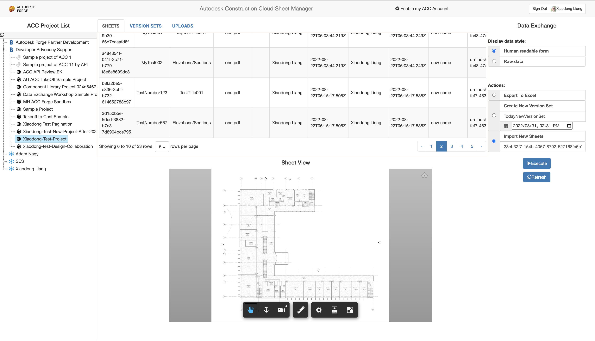
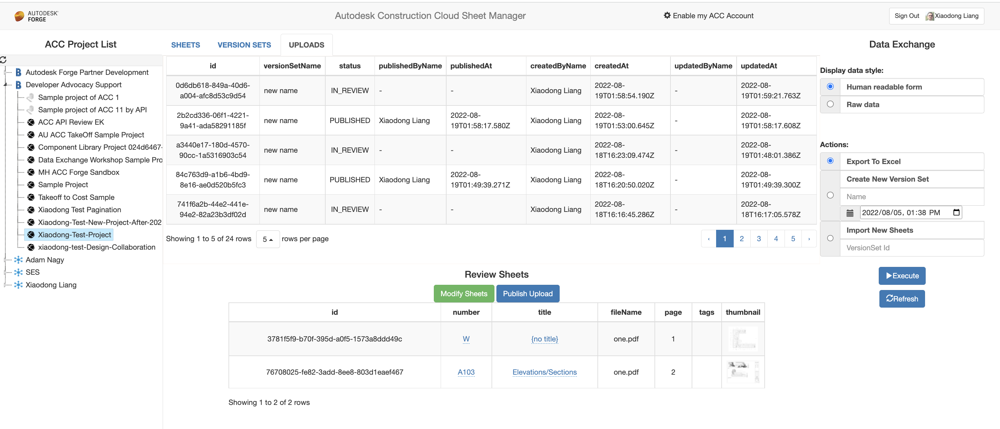
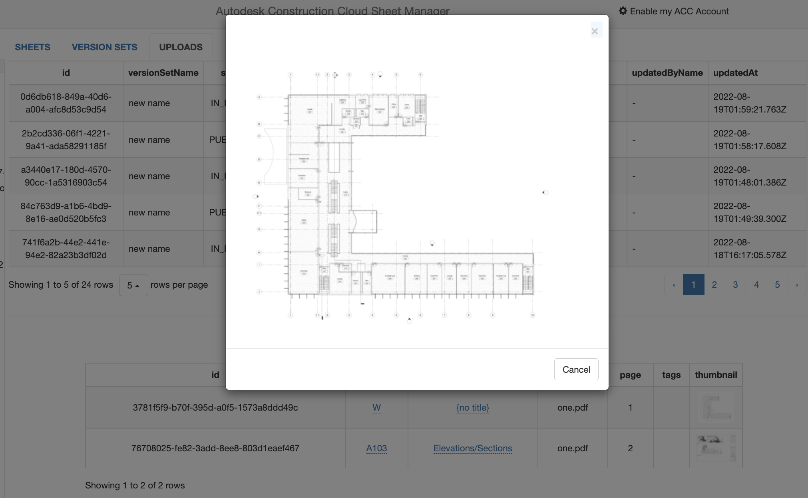
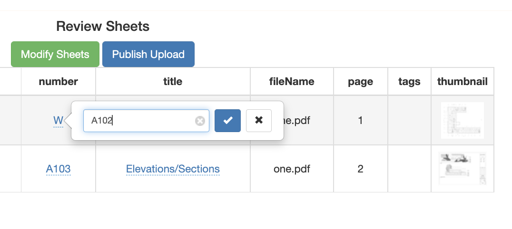
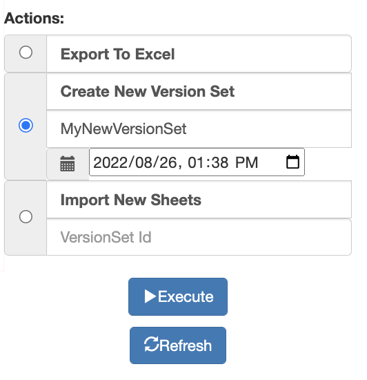
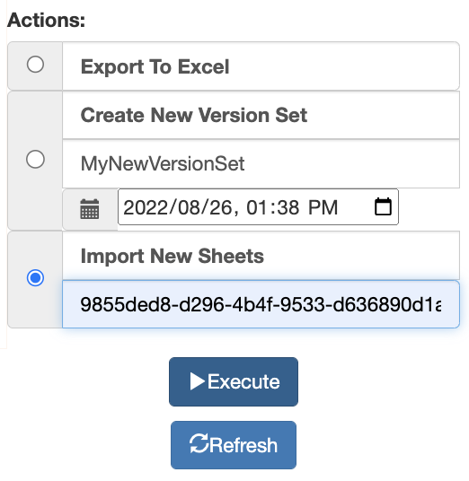

# ACC Sheets Export & Import Sample

 

## Description
This sample demonstrates the following use cases:

* Export sheets, version sets and uploads of ACC Sheet to excel file. The web application provides two options to display the ID properties either in **Raw data** and **Human readable form**.
* View basic information of published sheets. View published sheet in APS Viewer
* View basic information of uploads. List reviewing sheets of uploads (when upload status is IN_REVIEW)
* Modify number and title of reviewing sheets
* Publish reviewing sheets  
* Create new sheets from source PDF 
* Delete sheets (coming soon)

This sample is implemented based on Node.js version of [Learn APS Tutorial](http://aps.autodesk.com/tutorials), please refer to the tutorial for details about the framework.

## Thumbnail
  

## Demonstration

# Web App Setup

## Prerequisites

1. **APS Account**: Follow [this tutorial](http://aps.autodesk.com/tutorials/) to create a APS Account, activate subscription and create an app. For this new app, use **http://localhost:3000/api/aps/callback/oauth** as Callback URL. Finally take note of the **Client ID** and **Client Secret**.
2. **ACC Account**: must be Account Admin to add the app integration. It is same to BIM360 integration. [Learn about how to integrate](https://aps.autodesk.com/en/docs/bim360/v1/tutorials/getting-started/manage-access-to-docs/). 
3. **ACC Sheet**: In one project of Autodesk Construction Cloud, import some sheets manually through UI features. Please check [product help](https://help.autodesk.com/view/BUILD/ENU/?guid=Upload_And_Publish_Sheets) for more information
4. **Node.js**: basic knowledge with [**Node.js**](https://nodejs.org/en/).
5. **JavaScript** basic knowledge with **jQuery**

## Running locally

Install [NodeJS](https://nodejs.org), version 8 or newer.

Clone this project or download it (this `nodejs` branch only). It's recommended to install [GitHub desktop](https://desktop.github.com/). To clone it via command line, use the following (**Terminal** on MacOSX/Linux, **Git Shell** on Windows):

    git clone https://github.com/

Install the required packages using `npm install`.

**Environment**

Set the environment variables with your client ID & secret and finally start it. Via command line, navigate to the folder where this repository was cloned and use the following:

Mac OSX/Linux (Terminal)

    npm install
    export APS_CLIENT_ID=<<YOUR CLIENT ID FROM DEVELOPER PORTAL>>
    export APS_CLIENT_SECRET=<<YOUR CLIENT SECRET>>
    export APS_CALLBACK_URL=<<YOUR CALLBACK URL>>

    npm start

Windows (use **Node.js command line** from Start menu)

    npm install
    set APS_CLIENT_ID=<<YOUR CLIENT ID FROM DEVELOPER PORTAL>>
    set APS_CLIENT_SECRET=<<YOUR CLIENT SECRET>>
    set APS_CALLBACK_URL=<<YOUR CALLBACK URL>>

    npm start

OR, set environment variables of [launch.json](/.vscode/launch.json) for debugging.

## Use Cases

1. Open the browser: [http://localhost:3000](http://localhost:3000). 
2. After user logging, select a project. The code will start extracting all assets, version sets and uploads. They will be displayed in the main table view. Switch _Raw data_ to check _IDs_ data.
3. Click _Export_ option of **Actions** and click _Execute_ button to download excel file. 
4. Switch to Sheets tab of the main table view, click any row of sheet, the corresponding sheet will be loaded in APS Viewer.

  
5. Switch to Uploads tab of the main table view, click any row of upload whose status is IN_REVIEW, the corresponding reviewing sheets will be displayed.

  
6. Click thumbnail column of the reviewing sheets table, the bigger thumbnail will show up

  
7. Click _title_ or _number_ column, you can edit the values.

  
8. Click **Modify Sheets**, Sheet API will update number or title with updated values
9. Click **Publish Sheets**, Sheet API will publish the reviewing sheets. The status of the upload will be changed to PUBLISHED. If any issue with the reviewing sheets, the API will throw exception message.
10. Click _Create New Version Set_ option of **Actions**, input name and issuanceDate of the new set and click _Execute_ button. It will create a new version set. Switch to Uploads tab of the main table view to check it. 

  
11. Click _Create New Sheets_ option of **Actions**, input the id of the version set you want to upload to, click _Execute_ button, select one pdf file in the popup dialog. After the process is completed, the new upload will be available in the list of Uploads. The initial status is PROCESSING. When it is IN_REVIEW, you can review & publish sheets like step #5-9.

  

## Deployment

To deploy this application to Heroku, the **Callback URL** for APS must use your `.herokuapp.com` address. After clicking on the button below, at the Heroku Create New App page, set your Client ID, Secret and Callback URL for APS.

## Limitation
1. In this version, only one source PDF can be uploaded. It can be extended to multiple PDFs
2. In this version, only title and number can be edited with reviewing sheets. It can be extended to support modification of other attributes.

## Tips & Tricks

1. When editing title or number of reviewing sheets, ensure the values are unique in one version set. 
2. This sample adopts the library of editable-table, which conflicts to date-picker of Bootstrap. So the sample workaround by common date picker (datetime-local).

## Further Reading

**Document**
- [Sheets API Field Guid](https://aps.autodesk.com/en/docs/acc/v1/overview/field-guide/sheets/)
- [Sheets API Reference](https://aps.autodesk.com/en/docs/acc/v1/reference/http/sheets-sheets-GET/)

**Tutorials**:
- [Upload Files to ACC Sheets](https://aps.autodesk.com/en/docs/acc/v1/tutorials/sheets/upload-sheets/)

**Blogs**:
- [APS Blog](https://aps.autodesk.com/en/docs/acc/v1/tutorials/sheets/upload-sheets/)
- [Field of View](https://fieldofviewblog.wordpress.com/), a BIM focused blog

## License
This sample is licensed under the terms of the [MIT License](http://opensource.org/licenses/MIT). Please see the [LICENSE](LICENSE) file for full details.

## Written by
Xiaodong Liang [@coldwood](https://twitter.com/coldwood), [Developer Advocate and Support](http://aps.autodesk.com)

## Change Log
- 09/01/2022: first release